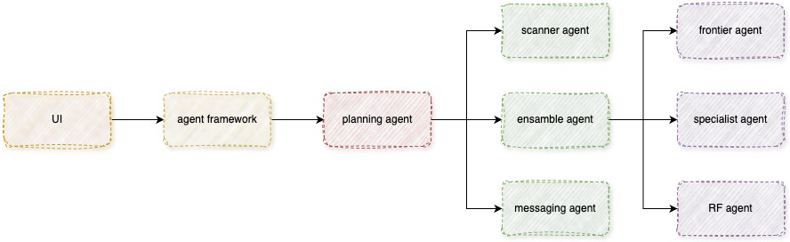

# agantic-ai-pricing-solution
This repository contains the components of dynamic pricing engine, leveraging LLM, ML and data analytics to optimize product pricing strategies with push notifications for bargain opportunities and price drops.

# Architecture



# Test and PoC Environment

Tests are run in a separate environment to avoid conflicts and PoC for building the components done in Jupyter Notebook.

- **Create a virtual environment**

```bash
conda env create -f environment.yml 
```


- **Activate the virtual environment**

```bash
conda activate llms
```

- lunch jupyter lab

```bash
jupyter lab
```
### Test folder includes:

1- curation of data (using huggingface datasets)

2- training of random forest model (using sklearn)

3- finetuning of openai model (using openai api)


## LLM Agent

## Data Agent

## Pricing Agent